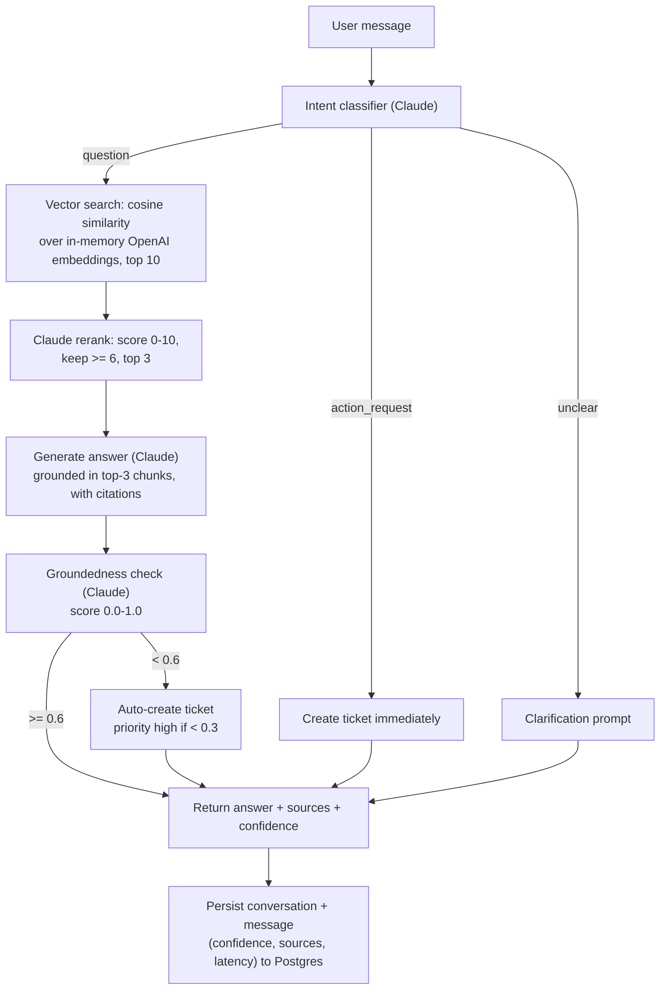

# DeskPilot: an internal helpdesk agent that knows when not to trust itself

Internal helpdesks get the same HR/IT/onboarding questions over and over, and a RAG chatbot that answers confidently when it's wrong erodes trust faster than having no bot at all. Teams shipping AI support agents need two things a typical RAG demo skips: a per-answer signal for whether to trust the model or hand off to a human, and a way to prove a prompt or retrieval change didn't quietly regress answer quality.

## What it does

- Classifies every incoming message as `question`, `action_request`, or `unclear` before touching retrieval, so action requests go straight to ticket creation and vague messages get a clarification prompt instead of a guessed answer (`lib/ai/classifier.ts`)
- Runs two-stage retrieval: cosine-similarity search over pre-computed OpenAI `text-embedding-3-small` embeddings (69 chunks held in memory) pulls the top 10 candidates, then a single batched Claude call scores each candidate 0-10 and keeps the top 3 that score 6 or above (`lib/retrieval/vectorStore.ts`, `lib/ai/reranker.ts`, `lib/retrieval/pipeline.ts`)
- Generates an answer grounded only in the retrieved chunks, with inline `[Source: doc]` citations, and refuses to answer when nothing survives the rerank filter (`lib/ai/generator.ts`)
- Runs a second, independent Claude call after generation to score the answer's groundedness (0.0-1.0) against the chunks actually used, and auto-creates a support ticket when the score drops below 0.6 (priority `high` below 0.3) - this is the escalation/handoff path (`lib/ai/confidence.ts`, `app/api/chat/route.ts`)
- Ships a 30-case golden dataset (10 each across HR/IT/Onboarding, split easy/medium/hard) and an eval runner that computes 8 metrics per run: retrieval precision@3, retrieval recall, answer correctness, avg confidence, confidence calibration, hallucination rate, escalation accuracy, avg latency (`lib/eval/golden-dataset.json`, `lib/eval/metrics.ts`, `lib/eval/runner.ts`). This metric taxonomy became the seed for [llm-evalgate](https://github.com/thetomtoro/llm-evalgate), a standalone CI eval harness with the same precision/recall/calibration/hallucination-rate definitions, generalized to gate any LLM pipeline's build.
- Persists every conversation, ticket, and eval run to Postgres via Prisma, so eval history and operational analytics survive across deploys (`prisma/schema.prisma`)

## Architecture



## Key design decisions

1. **Confidence is a second, post-generation Claude call, not the retrieval score.** Alternative rejected: reuse the reranker's relevance score as a proxy for answer confidence. Why: relevance is a property of the retrieved chunk, but groundedness is a property of the generated answer relative to the chunks actually used - a highly relevant chunk can still produce a hallucinated answer that miscombines information (`lib/ai/confidence.ts`).

2. **In-memory cosine similarity over pre-baked embeddings, not a live ChromaDB server.** The project started on ChromaDB (`scripts/export-embeddings.ts` still reads the original Chroma collection to regenerate the export), but a persistent local Chroma process doesn't run on Vercel's serverless functions. Alternative rejected: keep ChromaDB and require a separately hosted vector DB. Why: at 69 chunks (~2MB of embeddings), an in-memory array with cosine similarity is both faster than a network round-trip and deployable as a static asset (`lib/retrieval/vectorStore.ts`, commit `cb6fa31`).

3. **Postgres (Neon) via Prisma, not SQLite.** Same constraint as #2: serverless functions have no writable local disk to persist a SQLite file across invocations. Alternative rejected: `better-sqlite3` (the original design - `@prisma/adapter-better-sqlite3` and `better-sqlite3` are still listed in `package.json` as dependencies but are no longer imported anywhere in the codebase). Why: Prisma's adapter pattern kept the swap to `lib/db/index.ts` - it now builds its client with `PrismaPg` against `DATABASE_URL`, no schema rewrite needed (`lib/db/index.ts`, `.env.example`).

4. **LLM reranking as a second stage over the raw vector top-10, not vector similarity alone.** Alternative rejected: return the top-3 by cosine similarity directly. Why: embedding similarity catches broad semantic overlap but can't distinguish "mentions PTO" from "answers this specific PTO question" - the Claude rerank step is what makes precision@3 meaningful rather than just recall (`lib/ai/reranker.ts`).

5. **Single-turn Q&A: each question is retrieved and answered independently of conversation history.** Alternative rejected: multi-turn retrieval with query rewriting. Why: query rewriting is its own failure surface, and folding it into this pipeline would make it impossible to isolate whether a wrong answer came from retrieval, reranking, or generation - the golden dataset is written to test one turn at a time (`app/api/chat/route.ts`).

## Measured results

Only the Jest unit tests were runnable offline in this environment - `/api/chat` and `/api/eval` require `ANTHROPIC_API_KEY`, `OPENAI_API_KEY`, and a live Postgres `DATABASE_URL` (see `lib/env.ts`), none of which were available, so no eval/pipeline numbers are reported here.

```
$ npm test

> deskpilot@0.1.0 test
> jest

Test Suites: 1 passed, 1 total
Tests:       3 passed, 3 total
Snapshots:   0 total
Time:        0.284 s
Ran all test suites.
```

These 3 tests (`lib/retrieval/chunker.test.ts`) cover the markdown chunker: heading-based splitting, section-title metadata preservation, and the no-heading fallback path.

To reproduce the eval metrics (precision@3, recall, correctness, calibration, hallucination rate, escalation accuracy, latency) across the 30-case golden dataset, set both API keys and `DATABASE_URL`, run `npm run dev`, and trigger a run from `/eval` - each run persists to `EvalRun`/`EvalResult` and appears on the dashboard for historical comparison.

## Quickstart

```bash
git clone https://github.com/thetomtoro/DeskPilot.git
cd DeskPilot
npm install                     # verified in this task, see Measured results
npm test                        # verified in this task - runs without any keys
cp .env.example .env.local      # fill in ANTHROPIC_API_KEY, OPENAI_API_KEY, DATABASE_URL (Postgres)
npx prisma migrate dev
npm run dev
open http://localhost:3000
```

`npm run ingest` reads every `.md`/`.txt` file in `./knowledge/`, chunks it, embeds it via OpenAI, and pushes the chunks into the in-memory vector store for that process (`lib/retrieval/vectorStore.ts` holds `chunks` as a module-level array with no disk write-back, so this only persists for the life of one long-running process such as `next dev` - `scripts/export-embeddings.ts` is the separate script that regenerates the committed `lib/retrieval/embeddings.json` snapshot). `npm test` is the only command that runs without API keys; everything touching `/api/chat`, `/api/eval`, or `npm run ingest` needs `ANTHROPIC_API_KEY`, `OPENAI_API_KEY`, and a reachable `DATABASE_URL`, and fails fast with a clear error if they're missing (`lib/env.ts`).

## Stack

Next.js 14 (App Router) + TypeScript, Claude (`claude-sonnet-4-20250514` via `@anthropic-ai/sdk`) for classification/reranking/generation/confidence, OpenAI `text-embedding-3-small` embeddings over an in-memory cosine-similarity store, Prisma + Postgres (Neon), Jest.

---

Built by Tommy Ong - [GitHub](https://github.com/thetomtoro)
